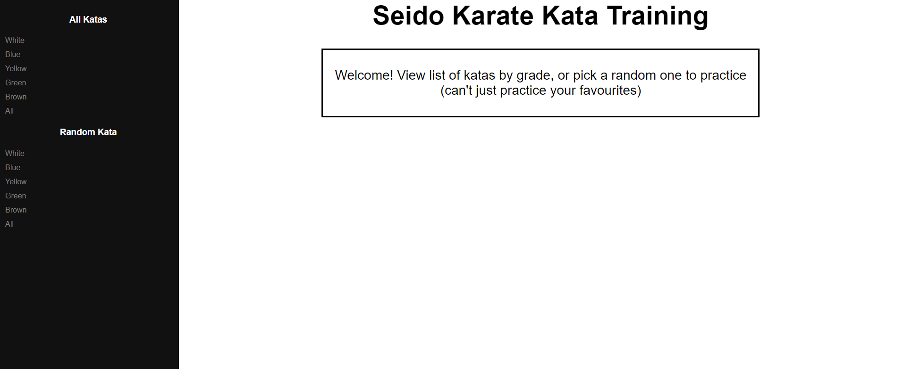
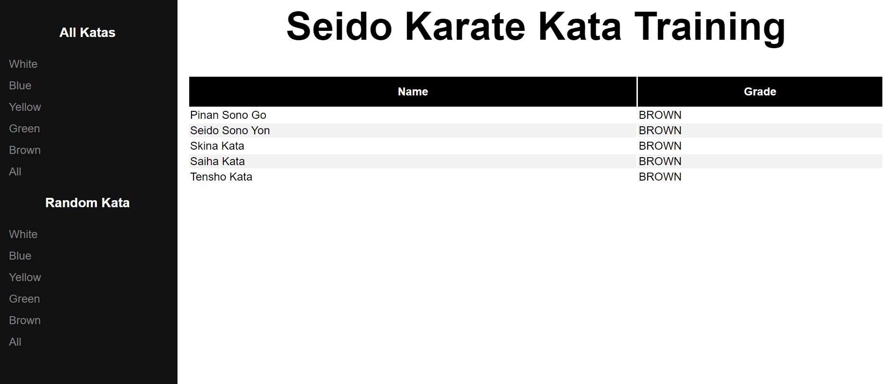
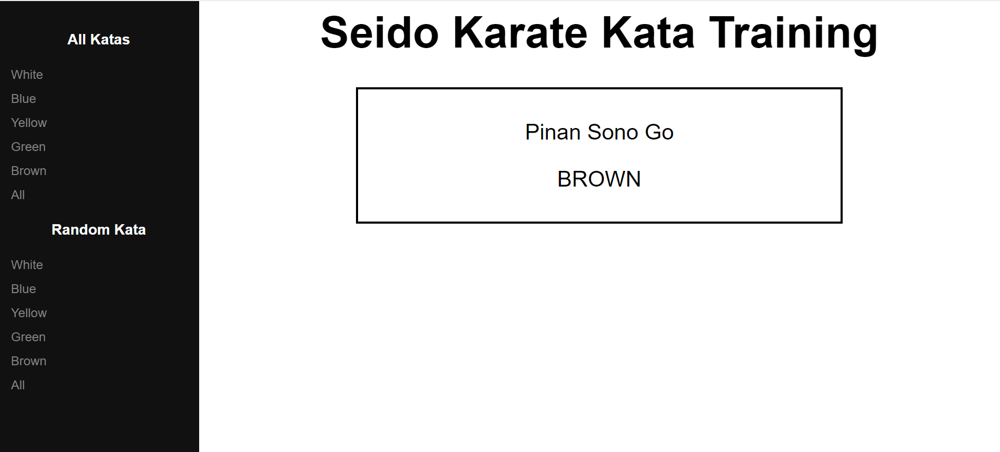

# Seido-Kata-Spring-Thymeleaf

## Introduction
Seido Karate Kata Training is a [Spring Boot](https://spring.io/guides/gs/spring-boot) application built using [Maven](https://spring.io/guides/gs/maven/). It is running java 8 and uses Thymeleaf dependencies for server-side rendering. The application allows users to view all katas under Seido Karate (which  they can view by grade) and pick random katas to practice to avoid only training their best/favourites.

You can build a jar file and run it from the command line. You need to run mvn clean install in the same directory as the pom.xml file. You will fiond the jar file in /target once you have done this.

```
mvn clean install
java -jar kata-0.0.1-SNAPSHOT.jar
```

You can then access Seido Karate Kata Training here: http://localhost:8080/



## Working with Seido-Kata-Spring-Thymeleaf in your IDE

### Prerequisites
The following items should be installed in your system:
* Java
* git command line tool
* Your preferred IDE 

### Steps:

1) Clone this repo in command line

```
git clone https://github.com/alexanmich/Seido-Karate-REST-api-Springboot.git
```
   
2) Import project from files 
    ```
    File -> Open -> cloned project
    ```
3) Run KataApplication.jar

4) Navigate to Seido Karate Kata Training

    Visit [http://localhost:8080](http://localhost:8080) in your browser.


## Endpoints
1) /all
2) /all/{grade}



3) /random
4) /random/{grade}



## Notes
This project does not connect to a database but instead has a mock repositrory (KataRepository.jar)
